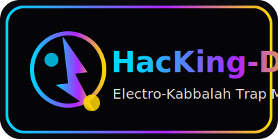

# 🎚️ HacKing-DJ

**תוכנת DJ מלאה שרצה בדפדפן** - ללא התקנות, עם כל הכלים המקצועיים 🎧⚡

HacKing-DJ מביאה מיקסר דפדפן מלא עם אסתטיקה של "SparKing Ascension" וריבוי שפות. כל מה שצריך זה לפתוח את `index.html` ולשגר סטים אלקטרוניים מהרגע הראשון.

[](https://github.com/AnLoMinus/HacKing-DJ)
[](https://www.youtube.com/@HacKing-DJ)





---

## ⚡ מה זה?

**HacKing-DJ** היא תוכנת DJ מתקדמת שרצה ישירות בדפדפן שלך. שני דקים, מיקסר מקצועי, אפקטים, לופים, ויזואליזציה - הכל בטכנולוגיות Web מודרניות.

### ⚡ תיאור קצר ומהיר
- סטארט חזק: פתיחה מיידית ללא התקנות.
- חוויית DJ מלאה: שני דקים, מיקסר, BPM/SYNC ותצוגות גל.
- חזות ניאון: צבעים חשמליים וגרעיני גלו שמבליטים את האפליקציה במסכים חשוכים.

---

## 🎛️ תכונות עיקריות

- 🎚️ **שני דקים** (A / B) עם שליטה מלאה
- 🎛️ **מיקסר מקצועי** - Crossfader, EQ, Master Volume
- 🎵 **טעינת קבצי אודיו** - מקובץ מקומי או קישור
- 🔁 **לופים וקיואים** - שליטה מלאה על נקודות התחלה
- 🎨 **ויזואליזציה** - Waveform ו-Real-time Visualizer
- ⏱️ **BPM & Sync** - סנכרון אוטומטי בין דקים
- 🎙️ **הקלטה** - שמירת סטים שלך

---

## 🚀 התחלה מהירה

1. הורד או שחזר את הפרויקט.
2. פתח את `index.html` בדפדפן (Edge/Chrome/Firefox).
3. טען קבצי אודיו לדקים, כוון BPM/Volume, והתחל למיקס! 🎧
4. רוצה לוק ניאון מלא? השתמש בלוגואים שבתיקיית `assets/img` כדי למתג מצגות או שיתופים.

---

## 🏗️ טכנולוגיות

- **HTML5** - מבנה בסיסי
- **CSS3** - עיצוב SparKing Ascension Style
- **JavaScript (Vanilla)** - לוגיקה ושליטה
- **Web Audio API** - מנוע האודיו המרכזי
- **i18n** - מערכת תרגום רב-לשונית מובנית

---

## 📁 מבנה הפרויקט

```
HacKing-DJ/
├── index.html          # עמוד ראשי
├── assets/
│   ├── css/
│   │   └── style.css   # עיצוב SparKing
│   ├── js/
│   │   ├── main.js
│   │   ├── audioEngine.js
│   │   ├── decks.js
│   │   ├── mixer.js
│   │   └── ui.js
│   └── img/
├── docs/               # תיעוד
└── README.md
```

---

## 🎨 סגנון

**SparKing Ascension Style** - עיצוב ניאון קוסמי עם:
- רקע כהה קוסמי
- כפתורים ניאון כחול-סגול-זהב
- Waveform בצבע חשמלי
- אנימציות קלות וזורמות

### 🖌️ קווים מנחים לעיצוב
- **טיפוגרפיה**: כותרות עם `var(--font-display)` (Segoe UI/Inter), טקסט גוף עם `var(--font-body)`.
- **פלטת צבעים**: `#00d4ff` (Neon Blue), `#b026ff` (Neon Purple), `#ffd700` (Neon Gold), `#3af2c5` (Mint Accent), רקע כהה `#0a0a0f`.
- **משטחי UI**: שימוש ב-`--surface` ו-`--surface-strong` ב-CSS לכרטיסיות ורכיבים עם גבול קל `--card-border` וגלו עדין.
- **צללים וגלו**: שמרו על עומק עם `--glow-blue`, `--glow-purple`, `--glow-gold` או `--glow-mint` – לא יותר משניים בו-זמנית כדי להימנע מרעש.
- **סמלים ולוגואים**: השתמשו ב-`assets/img/logo-mark.svg` לאייקון קטן/פאביקון וב-`assets/img/logo-badge.svg` לכותרות או שקופיות.

---

## 🛣️ Roadmap

- [x] תכנון וארכיטקטורה
- [ ] שלב 1: גרסת בסיס (2 דקים + מיקסר)
- [ ] שלב 2: ווליום, EQ ו-Waveform
- [ ] שלב 3: לופים וקיואים
- [ ] שלב 4: BPM & Tempo
- [ ] שלב 5: פלייליסט וסטים
- [ ] שלב 6: הקלטה ושיפורים

---

## 📚 מסמכים נוספים

- 📜 [CHANGELOG.md](CHANGELOG.md) - יומן שינויים
- 🛣️ [ROADMAP.md](ROADMAP.md) - מפת דרכים
- ✨ [FEATURES.md](FEATURES.md) - רשימת תכונות
- 🌍 [docs/TRANSLATION.md](docs/TRANSLATION.md) - מדריך תרגום
- 🤝 [CONTRIBUTING.md](CONTRIBUTING.md) - מדריך תרומה
- 👥 [CONTRIBUTORS.md](CONTRIBUTORS.md) - תורמים
- 👤 [AUTHORS.md](AUTHORS.md) - מחברים
- 💎 [SPONSORS.md](SPONSORS.md) - חסויות ותמיכה
- 🔒 [SECURITY.md](SECURITY.md) - מדיניות אבטחה
- 📜 [CODE_OF_CONDUCT.md](CODE_OF_CONDUCT.md) - קוד התנהגות
- 📄 [LICENSE](LICENSE) - רישיון MIT

---

## 🔗 קישורים

- 📦 **GitHub Repository:** [github.com/AnLoMinus/HacKing-DJ](https://github.com/AnLoMinus/HacKing-DJ)
- 🎥 **ערוץ YouTube:** [@HacKing-DJ](https://www.youtube.com/@HacKing-DJ)

---

## 👑 קרדיטים

**SparKing Ascension • Electro-Kabbalah Cosmic Trap**  
יצירה של **AnLoMinus (Leon Yaakobov)**

---

## 📜 רישיון

רישיון MIT - ראה [LICENSE](LICENSE) לפרטים מלאים.

---

## ⚡ פסוק מחזק

**"מִן הַמֵּצַר קָרָאתִי יָ-הּ, עָנָנִי בַמֶּרְחַב יָ-הּ"** (תהילים קי״ח)

מהמצר של רעש וכאוס – אתה פותח מרחב חדש של קצב קדוש 🎧🔥

